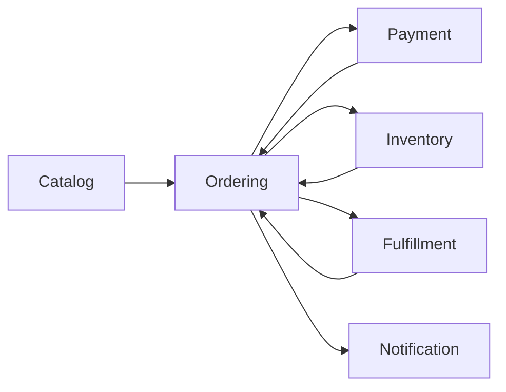
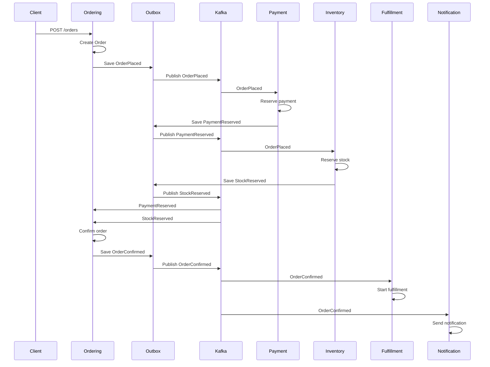
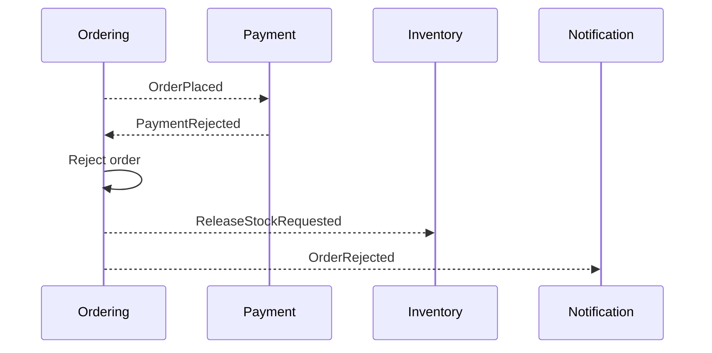
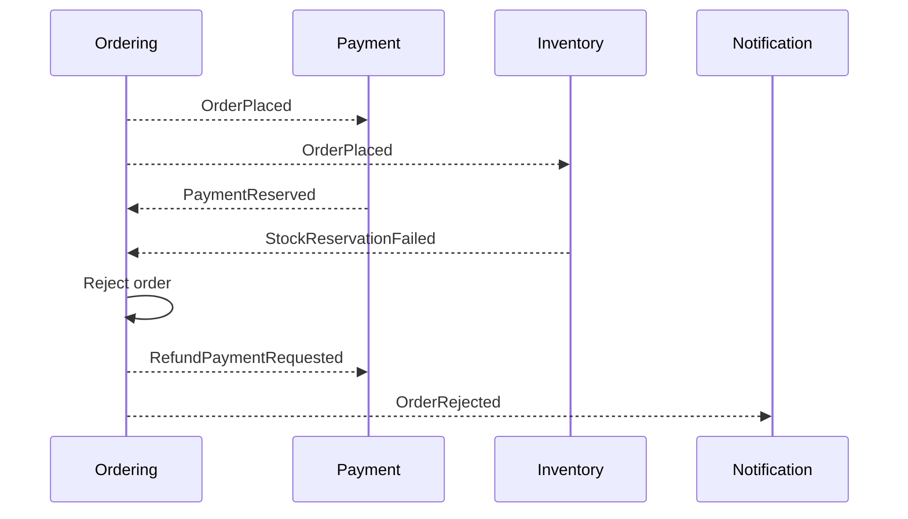

# Marketplace Order Fulfillment Platform

> Modularny monolit do nauki świadomej architektury, DDD, integracji asynchronicznych, odporności na awarie oraz praktycznego minimum DevOps.

## Spis treści

1. [Cel projektu](#cel-projektu)
2. [Dlaczego ten projekt istnieje](#dlaczego-ten-projekt-istnieje)
3. [Zakres funkcjonalny](#zakres-funkcjonalny)
4. [Najważniejsze założenia architektoniczne](#najważniejsze-założenia-architektoniczne)
5. [Dlaczego modularny monolit](#dlaczego-modularny-monolit)
6. [Kiedy ten monolit przestaje wystarczać](#kiedy-ten-monolit-przestaje-wystarczać)
7. [Moduły systemu](#moduły-systemu)
8. [Mapa kontekstów](#mapa-kontekstów)
9. [Model domenowy](#model-domenowy)
10. [Granice transakcji](#granice-transakcji)
11. [Architektura kodu](#architektura-kodu)
12. [Reguły zależności](#reguły-zależności)
13. [Główny flow biznesowy](#główny-flow-biznesowy)
14. [Eventy domenowe i integracyjne](#eventy-domenowe-i-integracyjne)
15. [Outbox pattern](#outbox-pattern)
16. [Kafka i asynchroniczność](#kafka-i-asynchroniczność)
17. [Idempotencja konsumentów](#idempotencja-konsumentów)
18. [Retry, backoff, jitter, DLQ i replay](#retry-backoff-jitter-dlq-i-replay)
19. [Wersjonowanie eventów](#wersjonowanie-eventów)
20. [Spójność danych i eventual consistency](#spójność-danych-i-eventual-consistency)
21. [API HTTP](#api-http)
22. [Baza danych](#baza-danych)
23. [Observability](#observability)
24. [Konfiguracja aplikacji](#konfiguracja-aplikacji)
25. [Docker](#docker)
26. [Kubernetes](#kubernetes)
27. [Testy](#testy)
28. [ADR — Architecture Decision Records](#adr--architecture-decision-records)
29. [Scenariusze awarii do przećwiczenia](#scenariusze-awarii-do-przećwiczenia)
30. [Jak uruchomić projekt lokalnie](#jak-uruchomić-projekt-lokalnie)
31. [Jak pracować z projektem](#jak-pracować-z-projektem)
32. [Kryteria ukończenia projektu](#kryteria-ukończenia-projektu)
33. [Czego celowo nie ma w projekcie](#czego-celowo-nie-ma-w-projekcie)

---

## Cel projektu

Celem projektu jest zbudowanie systemu **Marketplace Order Fulfillment Platform** jako **modularnego monolitu**, który pozwala przećwiczyć decyzje architektoniczne charakterystyczne dla poziomu Mid+ → Senior Backend Engineer.

Projekt nie jest kolejnym CRUD-em. Ma służyć do nauki:

- wyznaczania granic modułów,
- projektowania bounded contextów,
- stosowania DDD strategicznego i taktycznego,
- oddzielania domeny od frameworka,
- projektowania use case’ów,
- pracy ze spójnością danych,
- stosowania eventów domenowych i integracyjnych,
- budowania idempotentnych konsumentów,
- obsługi retry, DLQ i replay,
- wersjonowania kontraktów eventów,
- diagnozowania systemu przez logi, metryki i correlation ID,
- uruchamiania aplikacji w Dockerze i Kubernetesie.

Po ukończeniu projektu osoba rozwijająca system powinna umieć nie tylko pokazać działający kod, ale też **obronić decyzje techniczne**: dlaczego system został zaprojektowany tak, a nie inaczej.

---

## Dlaczego ten projekt istnieje

Wiele projektów treningowych kończy się na prostym schemacie:

```text
Controller -> Service -> Repository
```

Taki układ może być wystarczający dla prostych aplikacji, ale słabo uczy architektury. Nie pokazuje:

- gdzie kończy się jeden model biznesowy, a zaczyna drugi,
- jak unikać przypadkowego coupling między częściami systemu,
- jak obsłużyć awarie w procesie asynchronicznym,
- jak działa retry i idempotencja,
- jak projektować eventy, które mogą ewoluować,
- jak diagnozować problemy produkcyjne.

Ten projekt ma celowo wymusić trudniejsze problemy:

- płatność może się nie udać,
- stock może być niedostępny,
- event może przyjść dwa razy,
- event może przyjść z opóźnieniem,
- konsument może paść w połowie operacji,
- payload eventu może być w starej wersji,
- integracja może być czasowo niedostępna,
- dane mogą być przejściowo niespójne.

To właśnie te sytuacje odróżniają projekt szkoleniowy od projektu, który faktycznie rozwija umiejętności architektoniczne.

---

## Zakres funkcjonalny

System obsługuje uproszczony proces zakupowy w marketplace.

Użytkownik może:

1. przeglądać produkty,
2. złożyć zamówienie,
3. sprawdzić status zamówienia,
4. anulować zamówienie, jeśli reguły biznesowe na to pozwalają.

System wewnętrznie:

1. tworzy zamówienie,
2. rezerwuje płatność,
3. rezerwuje stock,
4. potwierdza zamówienie,
5. uruchamia proces fulfillmentu,
6. wysyła powiadomienia,
7. obsługuje odrzucenie płatności,
8. obsługuje brak stocku,
9. uruchamia kompensacje, np. refund albo zwolnienie rezerwacji.

---

## Najważniejsze założenia architektoniczne

Projekt jest budowany jako:

```text
jeden deployowalny artefakt
wiele logicznie odseparowanych modułów
jedna fizyczna baza danych
osobne schematy bazodanowe per moduł
komunikacja przez API aplikacyjne i eventy
brak bezpośredniego dostępu do cudzych tabel
domena bez zależności od Springa
integracje zewnętrzne przez porty i adaptery
```

Najważniejsze decyzje:

- system zaczyna jako modularny monolit, a nie mikroserwisy,
- granice modułów wynikają z domeny, a nie z warstw technicznych,
- eventy służą do komunikacji między kontekstami,
- Outbox zapewnia niezawodne publikowanie eventów,
- konsumenci są idempotentni,
- retry i DLQ są częścią projektu, a nie dodatkiem na końcu,
- observability jest projektowane od początku.

---

## Dlaczego modularny monolit

Modularny monolit jest świadomym wyborem, ponieważ na tym etapie projektu największym ryzykiem nie jest skalowanie infrastruktury, tylko źle wyznaczone granice domenowe.

Mikroserwisy nie rozwiązują problemu złego modelu. Wręcz przeciwnie: jeżeli granice są źle wyznaczone, mikroserwisy tylko utrwalają błędny podział i dodają koszty sieciowe, operacyjne oraz organizacyjne.

W tym projekcie modularny monolit pozwala:

- szybko refaktoryzować granice modułów,
- utrzymać prostszy deployment,
- uniknąć rozproszonej transakcyjności na starcie,
- skupić się na modelu domenowym,
- stopniowo wprowadzać asynchroniczność,
- ćwiczyć architekturę bez kosztu pełnych mikroserwisów.

To nie jest przypadkowy monolit. To system, który ma jeden artefakt wdrożeniowy, ale wewnętrznie wymusza granice między kontekstami.

---

## Kiedy ten monolit przestaje wystarczać

Modularny monolit może przestać być wystarczający, gdy pojawią się konkretne punkty bólu:

### 1. Niezależne skalowanie modułów jest realnie potrzebne

Przykład:

- `catalog` obsługuje bardzo duży ruch odczytowy,
- `payment` ma niski, ale krytyczny ruch transakcyjny,
- `notification` generuje dużo zadań asynchronicznych.

Jeżeli każdy moduł ma zupełnie inne wymagania wydajnościowe, jeden artefakt wdrożeniowy może być ograniczeniem.

### 2. Zespoły blokują się na jednym release cycle

Jeżeli różne zespoły pracują nad różnymi bounded contextami i jeden wspólny release zaczyna spowalniać organizację, separacja deploymentu może mieć sens.

### 3. Awaria jednego modułu nie powinna wpływać na resztę systemu

Jeżeli błąd w module `notification` nie może ryzykować stabilności procesu zamówień, można rozważyć wydzielenie tego modułu.

### 4. Model danych wymaga fizycznej separacji

Przykład:

- inne wymagania retencji danych,
- inne wymagania bezpieczeństwa,
- inne wymagania audytu,
- osobne storage engines.

### 5. Granice domenowe są stabilne

Nie powinno się wydzielać mikroserwisów, dopóki granice modułów nie są dobrze rozumiane. Ten projekt zakłada najpierw modularny monolit, a dopiero później ewentualne wydzielanie.

---

## Moduły systemu

System składa się z następujących modułów:

```text
catalog
ordering
payment
inventory
fulfillment
notification
integration-events
shared-kernel
```

Każdy moduł ma własną odpowiedzialność i nie powinien bezpośrednio manipulować danymi innego modułu.

---

### catalog

Moduł `catalog` odpowiada za produkty widoczne w marketplace.

Odpowiedzialności:

- tworzenie produktu,
- zmiana ceny,
- dezaktywacja produktu,
- udostępnianie danych produktu dla procesu zamówienia.

Przykładowe use case’y:

```text
CreateProduct
ChangeProductPrice
DeactivateProduct
GetProductDetails
```

Przykładowe obiekty domenowe:

```text
Product
ProductId
ProductName
Money
ProductStatus
```

Ten moduł nie odpowiada za stock. Produkt może istnieć w katalogu, nawet jeśli aktualnie nie ma go w magazynie.

---

### ordering

Moduł `ordering` jest centralnym modułem domenowym.

Odpowiedzialności:

- przyjmowanie zamówień,
- utrzymywanie statusu zamówienia,
- pilnowanie reguł anulowania,
- reagowanie na informacje o płatności i stocku,
- decydowanie, kiedy zamówienie może przejść dalej.

Przykładowe use case’y:

```text
PlaceOrder
CancelOrder
ConfirmPaymentReserved
ConfirmStockReserved
RejectOrder
MarkOrderReadyForFulfillment
```

Główny agregat:

```text
Order
```

Przykładowe value objecty:

```text
OrderId
CustomerId
OrderLine
Money
Quantity
```

Przykładowe statusy:

```text
DRAFT
PLACED
PAYMENT_PENDING
STOCK_PENDING
CONFIRMED
FULFILLMENT_PENDING
COMPLETED
CANCELLED
REJECTED
```

Przykładowe invarianty:

- zamówienie nie może być puste,
- zamówienie nie może mieć pozycji z ilością mniejszą niż 1,
- nie można potwierdzić zamówienia bez potwierdzonej płatności i stocku,
- nie można anulować zamówienia zakończonego,
- odrzucone zamówienie nie może zostać później potwierdzone.

---

### payment

Moduł `payment` odpowiada za proces płatności.

Odpowiedzialności:

- rezerwacja płatności,
- potwierdzenie płatności,
- odrzucenie płatności,
- refund.

Przykładowe use case’y:

```text
ReservePayment
CapturePayment
RejectPayment
RefundPayment
```

Główny agregat:

```text
Payment
```

Przykładowe statusy:

```text
PENDING
RESERVED
CAPTURED
REJECTED
REFUNDED
```

Integracja z bramką płatności powinna być ukryta za portem:

```java
public interface PaymentGateway {
    PaymentReservationResult reserve(PaymentCommand command);
}
```

Adaptery mogą być różne:

```text
FakePaymentGateway
FailingPaymentGateway
SlowPaymentGateway
```

Dzięki temu domena i application layer nie zależą od konkretnej implementacji integracji.

---

### inventory

Moduł `inventory` odpowiada za dostępność produktów.

Odpowiedzialności:

- dodawanie stocku,
- rezerwowanie stocku dla zamówienia,
- zwalnianie rezerwacji,
- potwierdzanie rezerwacji,
- obsługa braku dostępnej ilości.

Przykładowe use case’y:

```text
AddStock
ReserveStock
ReleaseStock
ConfirmStockReservation
```

Przykładowe agregaty:

```text
StockItem
StockReservation
```

Przykładowe statusy rezerwacji:

```text
PENDING
RESERVED
FAILED
RELEASED
CONFIRMED
```

Ten moduł jest dobrym miejscem do ćwiczenia konfliktów i idempotencji.

---

### fulfillment

Moduł `fulfillment` odpowiada za realizację zamówienia po jego potwierdzeniu.

Odpowiedzialności:

- rozpoczęcie realizacji,
- pakowanie,
- wysyłka,
- dostarczenie,
- obsługa błędu realizacji.

Przykładowe use case’y:

```text
StartFulfillment
MarkAsPacked
MarkAsShipped
MarkAsDelivered
FailFulfillment
```

Przykładowy agregat:

```text
FulfillmentOrder
```

Przykładowe statusy:

```text
PENDING
PACKING
SHIPPED
DELIVERED
FAILED
```

---

### notification

Moduł `notification` odpowiada za powiadomienia.

Odpowiedzialności:

- wysyłka powiadomień o złożonym zamówieniu,
- wysyłka powiadomień o odrzuconym zamówieniu,
- wysyłka powiadomień o wysyłce,
- zapisywanie historii powiadomień.

Przykładowe use case’y:

```text
SendOrderPlacedNotification
SendOrderRejectedNotification
SendOrderShippedNotification
```

Ten moduł jest głównie integracyjny. Nie powinien zawierać skomplikowanej domeny.

---

### integration-events

Moduł techniczny zawierający kontrakty eventów integracyjnych.

Zawartość:

- nazwy eventów,
- wersje eventów,
- wspólna koperta eventu,
- serializacja i deserializacja,
- metadane eventów.

Przykładowa koperta eventu:

```json
{
  "eventId": "7f3f2b7f-1b3e-4b3a-9e0e-1f6f7f8f9a10",
  "eventType": "OrderPlaced",
  "eventVersion": 1,
  "correlationId": "b3f6f0e8-95b3-4f66-9db4-0e76b77ad2f1",
  "causationId": "2f6e0f2a-3b93-4a92-91dd-85f646d9131a",
  "occurredAt": "2026-05-27T12:00:00Z",
  "payload": {
    "orderId": "42f62f5e-8b60-4fd7-8e10-1307e4c281c1",
    "customerId": "f0fdbe5e-3db5-4633-a9a5-616ddaa8fd75",
    "totalAmount": "199.99",
    "currency": "PLN"
  }
}
```

---

### shared-kernel

`shared-kernel` powinien być mały.

Dopuszczalne elementy:

```text
Money
Currency
TechnicalId
Clock
DomainEvent
Result
```

Nie należy wrzucać tam wszystkiego, co jest “wspólne”. Zbyt duży shared kernel tworzy ukryty coupling między modułami.

---

## Mapa kontekstów



Relacje:

- `ordering` korzysta z danych katalogowych przy składaniu zamówienia,
- `ordering` publikuje informację o złożonym zamówieniu,
- `payment` i `inventory` reagują na zamówienie,
- `ordering` zbiera wyniki rezerwacji płatności i stocku,
- `fulfillment` startuje po potwierdzeniu zamówienia,
- `notification` reaguje na ważne zdarzenia biznesowe.

---

## Model domenowy

Projekt powinien rozróżniać:

- agregaty,
- encje,
- value objecty,
- domain services,
- application services,
- porty,
- adaptery.

### Agregat

Agregat to granica spójności transakcyjnej. W projekcie agregatami są między innymi:

```text
Order
Payment
StockItem
StockReservation
FulfillmentOrder
```

Agregat powinien chronić invarianty. Kod zmieniający stan agregatu powinien być metodą domenową, a nie przypadkowym setterem.

Przykład:

```java
public void confirmPayment(PaymentId paymentId) {
    if (this.status == OrderStatus.CANCELLED) {
        throw new OrderAlreadyCancelledException(id);
    }

    this.paymentStatus = PaymentStatus.RESERVED;
    confirmIfReady();
}
```

### Encja

Encja ma tożsamość, ale zwykle żyje wewnątrz agregatu.

Przykład:

```text
OrderLine
```

W prostszym modelu `OrderLine` może być value objectem. Jeżeli jednak pozycja zamówienia ma własną tożsamość i cykl życia, może stać się encją.

### Value object

Value object nie ma własnej tożsamości. Liczy się jego wartość.

Przykłady:

```text
Money
Quantity
CustomerId
ProductId
OrderId
```

Value object powinien walidować sam siebie.

Przykład:

```java
public record Quantity(int value) {
    public Quantity {
        if (value <= 0) {
            throw new IllegalArgumentException("Quantity must be positive");
        }
    }
}
```

### Domain service

Domain service jest potrzebny wtedy, gdy logika domenowa nie pasuje naturalnie do jednego agregatu.

Nie należy tworzyć domain service tylko dlatego, że w projekcie istnieje warstwa `service`.

### Application service / use case

Application service orkiestruje przypadek użycia.

Przykład:

```text
PlaceOrderUseCase
```

Jego odpowiedzialności:

- pobranie danych przez port,
- utworzenie agregatu,
- zapis agregatu,
- publikacja eventów,
- zarządzanie transakcją.

Nie powinien zawierać szczegółowej logiki domenowej, która należy do agregatu.

---

## Granice transakcji

Granica transakcji powinna zwykle obejmować jeden agregat albo jeden przypadek użycia w jednym module.

Przykład dla `PlaceOrder`:

```text
start transaction
  create Order aggregate
  save Order
  save OutboxEvent(OrderPlaced)
commit transaction
```

Nie należy robić jednej wielkiej transakcji obejmującej:

```text
Order
Payment
Inventory
Fulfillment
Notification
```

Taki model ukrywa problemy integracyjne i prowadzi do silnego sprzężenia.

---

## Architektura kodu

Proponowana struktura pakietów:

```text
src/main/java/pl/jakubtworek/marketplace
  /catalog
    /domain
    /application
    /infrastructure
    /api

  /ordering
    /domain
    /application
    /infrastructure
    /api

  /payment
    /domain
    /application
    /infrastructure
    /api

  /inventory
    /domain
    /application
    /infrastructure
    /api

  /fulfillment
    /domain
    /application
    /infrastructure
    /api

  /notification
    /application
    /infrastructure
    /api

  /integrationevents
    /api
    /serialization

  /sharedkernel
```

Każdy moduł powinien mieć podobną strukturę, ale nie musi być identyczny. Prosty moduł nie powinien być sztucznie rozbudowany tylko po to, żeby wyglądał “architektonicznie”.

---

### domain

Warstwa domenowa zawiera:

- agregaty,
- encje,
- value objecty,
- domain events,
- domain services,
- wyjątki domenowe.

Nie zawiera:

- Springa,
- JPA,
- kontrolerów,
- klientów HTTP,
- klientów Kafki,
- konfiguracji frameworka.

---

### application

Warstwa application zawiera:

- use case’y,
- porty wejściowe,
- porty wyjściowe,
- obsługę transakcji,
- orkiestrację procesu,
- mapowanie command/result.

Przykład:

```java
public interface PlaceOrderUseCase {
    PlaceOrderResult handle(PlaceOrderCommand command);
}
```

---

### infrastructure

Warstwa infrastructure zawiera adaptery:

- repozytoria JPA,
- implementacje portów,
- klienta Kafki,
- klienta HTTP,
- adaptery bramek płatności,
- serializację,
- konfigurację techniczną.

---

### api

Warstwa `api` zawiera adaptery wejściowe:

- REST controllers,
- DTO,
- mapowanie request/response,
- obsługę błędów HTTP.

---

## Reguły zależności

Dozwolone zależności:

```text
api -> application
application -> domain
infrastructure -> application
infrastructure -> domain
```

Niedozwolone zależności:

```text
domain -> application
domain -> infrastructure
domain -> api
application -> api
application -> infrastructure implementation
catalog -> payment.infrastructure
ordering -> inventory.infrastructure
payment -> ordering.infrastructure
```

Moduły nie powinny odwoływać się do wewnętrznych klas innych modułów.

Jeżeli `ordering` potrzebuje informacji z `catalog`, powinien korzystać z publicznego API aplikacyjnego lub eventu, a nie z repozytorium katalogu.

---

## Główny flow biznesowy

### Happy path



### Failure path — płatność odrzucona



### Failure path — brak stocku



---

## Eventy domenowe i integracyjne

W projekcie należy odróżnić eventy domenowe od eventów integracyjnych.

### Event domenowy

Event domenowy opisuje fakt, który wydarzył się w obrębie domeny.

Przykład:

```text
OrderPlacedDomainEvent
```

Może być używany wewnątrz modułu albo do przygotowania eventu integracyjnego.

### Event integracyjny

Event integracyjny jest kontraktem między modułami albo systemami.

Przykład:

```text
OrderPlacedIntegrationEvent
```

Musi być stabilniejszy niż event domenowy, bo konsumenci mogą od niego zależeć.

---

### Lista eventów

Minimalna lista eventów:

```text
OrderPlaced
OrderCancelled
OrderConfirmed
OrderRejected

PaymentReservationRequested
PaymentReserved
PaymentRejected
PaymentRefunded

StockReservationRequested
StockReserved
StockReservationFailed
StockReleased

FulfillmentStarted
OrderPacked
OrderShipped
OrderDelivered

NotificationRequested
NotificationSent
NotificationFailed
```

Nie wszystkie eventy muszą pojawić się w pierwszej wersji projektu. Należy je wdrażać etapami.

---

### Koperta eventu

Każdy event integracyjny powinien mieć wspólną kopertę:

```json
{
  "eventId": "uuid",
  "eventType": "OrderPlaced",
  "eventVersion": 1,
  "correlationId": "uuid",
  "causationId": "uuid",
  "occurredAt": "2026-05-27T12:00:00Z",
  "producer": "ordering",
  "payload": {}
}
```

Znaczenie pól:

| Pole | Znaczenie |
|---|---|
| `eventId` | Unikalny identyfikator eventu. Służy do idempotencji. |
| `eventType` | Typ eventu, np. `OrderPlaced`. |
| `eventVersion` | Wersja kontraktu eventu. |
| `correlationId` | Identyfikator całego przepływu biznesowego. |
| `causationId` | Identyfikator zdarzenia/komendy, która spowodowała ten event. |
| `occurredAt` | Czas wystąpienia faktu biznesowego. |
| `producer` | Moduł publikujący event. |
| `payload` | Dane biznesowe eventu. |

---

## Outbox pattern

Outbox pattern rozwiązuje problem:

```text
jak zapisać zmianę w bazie i opublikować event bez ryzyka utraty eventu?
```

Błędny wariant:

```text
save order
publish event
```

Jeżeli aplikacja padnie po zapisie zamówienia, ale przed publikacją eventu, reszta systemu nigdy nie dowie się o zamówieniu.

Poprawniejszy wariant:

```text
start transaction
  save order
  save event to outbox
commit transaction

outbox worker publishes event later
```

### Tabela `outbox_events`

Przykładowy schemat:

```sql
CREATE TABLE integration.outbox_events (
    id UUID PRIMARY KEY,
    aggregate_id UUID NOT NULL,
    aggregate_type VARCHAR(100) NOT NULL,
    event_type VARCHAR(100) NOT NULL,
    event_version INT NOT NULL,
    payload JSONB NOT NULL,
    correlation_id UUID NOT NULL,
    causation_id UUID,
    status VARCHAR(30) NOT NULL,
    created_at TIMESTAMP WITH TIME ZONE NOT NULL,
    published_at TIMESTAMP WITH TIME ZONE,
    retry_count INT NOT NULL DEFAULT 0,
    last_error TEXT
);
```

Przykładowe statusy:

```text
PENDING
PUBLISHED
FAILED
```

### Outbox worker

Worker powinien:

1. pobrać eventy w statusie `PENDING`,
2. opublikować je do brokera,
3. oznaczyć jako `PUBLISHED`,
4. przy błędzie zwiększyć `retry_count`,
5. po przekroczeniu limitu oznaczyć jako `FAILED`.

Ważne: worker musi być odporny na wielokrotne uruchomienie. Jeżeli działa kilka instancji aplikacji, nie powinny publikować tego samego eventu równolegle bez kontroli.

---

## Kafka i asynchroniczność

Kafka jest używana jako broker eventów integracyjnych.

Topic proposal:

```text
marketplace.order-events.v1
marketplace.payment-events.v1
marketplace.inventory-events.v1
marketplace.fulfillment-events.v1
marketplace.notification-events.v1
marketplace.dlq.v1
```

### Partition key

Dla eventów związanych z zamówieniem partition key powinien być:

```text
orderId
```

Uzasadnienie:

- eventy dla jednego zamówienia trafiają do tej samej partycji,
- Kafka zachowuje ordering w ramach partycji,
- łatwiej diagnozować przepływ konkretnego zamówienia.

### Consumer groups

Przykładowe consumer groups:

```text
payment-service-consumer
inventory-service-consumer
ordering-payment-events-consumer
ordering-inventory-events-consumer
fulfillment-order-events-consumer
notification-events-consumer
```

Mimo że aplikacja jest modularnym monolitem, można logicznie traktować konsumentów jako osobne procesy odpowiedzialności.

---

## Idempotencja konsumentów

Event może zostać dostarczony więcej niż raz. System musi być na to gotowy.

Nie projektujemy systemu z założeniem:

```text
event przyjdzie dokładnie raz
```

Projektujemy system z założeniem:

```text
event może przyjść 0, 1 albo wiele razy
event może przyjść z opóźnieniem
event może przyjść po awarii konsumenta
```

### Tabela `processed_events`

```sql
CREATE TABLE integration.processed_events (
    event_id UUID NOT NULL,
    consumer_name VARCHAR(150) NOT NULL,
    processed_at TIMESTAMP WITH TIME ZONE NOT NULL,
    status VARCHAR(30) NOT NULL,
    PRIMARY KEY (event_id, consumer_name)
);
```

### Algorytm konsumenta

```text
start transaction
  if processed_events contains (eventId, consumerName):
      skip processing
      commit transaction
      commit offset
      return

  process business operation
  insert into processed_events(eventId, consumerName)
commit transaction

commit offset
```

### Przykład

Jeżeli `PaymentReserved` przyjdzie dwa razy, `ordering` nie może drugi raz wykonać niebezpiecznej zmiany stanu.

Poprawne zachowanie:

```text
pierwszy event -> stan zamówienia aktualizowany
drugi event -> wykryty jako duplikat, brak zmiany biznesowej
```

---

## Retry, backoff, jitter, DLQ i replay

Nie każdy błąd powinien być obsługiwany tak samo.

### Błędy tymczasowe

Przykłady:

```text
timeout do bramki płatności
chwilowy brak połączenia z bazą
chwilowy brak połączenia z brokerem
HTTP 503 z systemu zewnętrznego
```

Obsługa:

```text
retry
exponential backoff
jitter
limit prób
```

### Błędy trwałe

Przykłady:

```text
niepoprawny payload eventu
brak wymaganego pola
nieobsługiwana wersja eventu
niemożliwa do naprawienia reguła biznesowa
```

Obsługa:

```text
DLQ
manual inspection
fix
replay
```

### Tabela `dead_letter_events`

```sql
CREATE TABLE integration.dead_letter_events (
    id UUID PRIMARY KEY,
    event_id UUID NOT NULL,
    event_type VARCHAR(100) NOT NULL,
    event_version INT NOT NULL,
    payload JSONB NOT NULL,
    reason TEXT NOT NULL,
    consumer_name VARCHAR(150) NOT NULL,
    failed_at TIMESTAMP WITH TIME ZONE NOT NULL,
    retry_count INT NOT NULL
);
```

### Replay

Replay powinien umożliwiać ponowne przetworzenie eventu z DLQ po naprawieniu przyczyny błędu.

Endpoint przykładowy:

```http
POST /admin/dlq/{eventId}/replay
```

Replay nie może omijać idempotencji. Jeżeli event został już poprawnie obsłużony, replay nie powinien wykonywać efektu ubocznego drugi raz.

---

## Wersjonowanie eventów

Eventy są kontraktami. Muszą ewoluować ostrożnie.

### `OrderPlacedV1`

```json
{
  "orderId": "uuid",
  "customerId": "uuid",
  "totalAmount": "199.99"
}
```

### `OrderPlacedV2`

```json
{
  "orderId": "uuid",
  "customerId": "uuid",
  "total": {
    "amount": "199.99",
    "currency": "PLN"
  },
  "salesChannel": "WEB"
}
```

### Reguły kompatybilności

Zmiany zwykle kompatybilne:

- dodanie opcjonalnego pola,
- dodanie nowego typu eventu,
- rozszerzenie enum tylko wtedy, gdy konsumenci obsługują wartość nieznaną.

Zmiany potencjalnie breaking:

- usunięcie pola,
- zmiana typu pola,
- zmiana znaczenia pola,
- zmiana nazwy pola,
- zmiana wymaganej semantyki eventu.

### Wymagania dla konsumenta

Konsument powinien:

- odczytywać znane wersje eventów,
- jawnie odrzucać nieobsługiwane wersje,
- logować wersję eventu,
- mieć testy kontraktowe dla wspieranych wersji.

---

## Spójność danych i eventual consistency

System nie próbuje utrzymać jednej transakcji przez wszystkie moduły.

Zamiast tego stosuje model:

```text
lokalna spójność w module
eventual consistency między modułami
kompensacje przy błędach
```

Przykład:

1. Zamówienie zostaje złożone.
2. Przez chwilę ma status `PAYMENT_PENDING` albo `STOCK_PENDING`.
3. Płatność i stock są rezerwowane niezależnie.
4. Zamówienie zostaje potwierdzone dopiero po otrzymaniu obu potwierdzeń.
5. Jeżeli jeden krok się nie uda, system wykonuje kompensację.

Status przejściowy nie jest błędem. Jest jawnie modelowanym elementem procesu.

---

## API HTTP

API HTTP powinno być proste. Nie powinno ujawniać wewnętrznych szczegółów domeny.

### Catalog

```http
POST /products
PATCH /products/{productId}/price
PATCH /products/{productId}/deactivate
GET /products/{productId}
```

### Ordering

```http
POST /orders
GET /orders/{orderId}
POST /orders/{orderId}/cancel
```

### Inventory

```http
POST /stock
GET /stock/{productId}
```

### Fulfillment

```http
GET /fulfillment/orders/{orderId}
POST /fulfillment/orders/{orderId}/mark-packed
POST /fulfillment/orders/{orderId}/mark-shipped
POST /fulfillment/orders/{orderId}/mark-delivered
```

### Admin / Operations

```http
GET /admin/outbox
POST /admin/outbox/{eventId}/replay

GET /admin/dlq
POST /admin/dlq/{eventId}/replay

GET /admin/consumers/lag
GET /admin/events/{correlationId}
```

Endpointy administracyjne są celowo częścią projektu, bo uczą myślenia operacyjnego.

---

## Baza danych

Na start projekt używa jednej fizycznej bazy PostgreSQL.

Separacja odbywa się przez schematy:

```text
catalog
ordering
payment
inventory
fulfillment
notification
integration
```

### Reguła

Moduł może czytać i pisać tylko do własnego schematu.

Przykład:

```text
ordering -> ordering.orders
payment -> payment.payments
inventory -> inventory.stock_items
```

Niedozwolone:

```text
ordering -> payment.payments
payment -> ordering.orders
inventory -> ordering.orders
```

Jeżeli moduł potrzebuje informacji z innego modułu, powinien dostać ją przez:

- publiczny use case,
- event,
- lokalną projekcję danych,
- jawnie opisany kontrakt.

---

## Observability

Observability nie jest dodatkiem na koniec. System powinien być projektowany tak, żeby dało się go diagnozować.

### Correlation ID

Każdy request HTTP powinien dostać `correlationId`.

Ten identyfikator powinien przejść przez:

```text
HTTP request
use case
domain event
outbox event
Kafka message
consumer
kolejny use case
logi
metryki
```

### Logi strukturalne

Każdy ważny log powinien zawierać:

```text
correlationId
causationId
eventId
orderId
module
consumerName
eventType
eventVersion
```

Przykład logu:

```json
{
  "level": "INFO",
  "message": "Payment reserved",
  "correlationId": "b3f6f0e8-95b3-4f66-9db4-0e76b77ad2f1",
  "eventId": "7f3f2b7f-1b3e-4b3a-9e0e-1f6f7f8f9a10",
  "orderId": "42f62f5e-8b60-4fd7-8e10-1307e4c281c1",
  "module": "payment"
}
```

### Metryki

Minimalne metryki:

```text
orders_placed_total
orders_confirmed_total
orders_rejected_total

payment_reservations_total
payment_reservations_failed_total

inventory_reservations_total
inventory_reservations_failed_total

consumer_retries_total
consumer_failures_total
dlq_events_total
outbox_pending_events
outbox_failed_events
event_processing_duration
consumer_lag
```

### Healthchecki

Aplikacja powinna udostępniać:

```http
GET /actuator/health
GET /actuator/health/liveness
GET /actuator/health/readiness
```

Readiness powinno uwzględniać gotowość aplikacji do obsługi ruchu, np. połączenie z bazą i brokerem.

---

## Konfiguracja aplikacji

Konfiguracja powinna pochodzić z runtime, nie z obrazu Dockera.

Przykładowe zmienne środowiskowe:

```text
SPRING_PROFILES_ACTIVE
SERVER_PORT

DATABASE_URL
DATABASE_USERNAME
DATABASE_PASSWORD

KAFKA_BOOTSTRAP_SERVERS
KAFKA_CONSUMER_GROUP_PREFIX

PAYMENT_GATEWAY_MODE
OUTBOX_WORKER_ENABLED
OUTBOX_WORKER_INTERVAL

RETRY_MAX_ATTEMPTS
RETRY_INITIAL_DELAY
RETRY_MAX_DELAY
```

Nie należy hardcodować adresów usług w kodzie.

---

## Docker

Projekt powinien zawierać:

```text
Dockerfile
.dockerignore
docker-compose.yml
```

### Dockerfile

Wymagania:

- multi-stage build,
- osobny etap build,
- mały obraz runtime,
- brak sekretów w obrazie,
- konfiguracja przez zmienne środowiskowe.

Przykładowa struktura:

```dockerfile
FROM eclipse-temurin:21-jdk AS build
WORKDIR /app
COPY . .
RUN ./mvnw clean package -DskipTests

FROM eclipse-temurin:21-jre
WORKDIR /app
COPY --from=build /app/target/*.jar app.jar
EXPOSE 8080
ENTRYPOINT ["java", "-jar", "app.jar"]
```

### docker-compose

Minimalne usługi:

```text
app
postgres
kafka
kafka-ui
```

Opcjonalnie:

```text
prometheus
grafana
```

Przykładowe komendy:

```bash
docker compose up -d
docker compose logs -f app
docker compose down -v
```

---

## Kubernetes

Projekt powinien działać lokalnie na `kind` albo `minikube`.

Struktura katalogu:

```text
k8s/
  app-deployment.yaml
  app-service.yaml
  postgres-deployment.yaml
  postgres-service.yaml
  kafka-deployment.yaml
  kafka-service.yaml
  configmap.yaml
  secret.yaml
```

### Deployment aplikacji

Deployment powinien mieć:

- readiness probe,
- liveness probe,
- konfigurację przez ConfigMap,
- sekrety przez Secret,
- rolling update,
- resource requests/limits.

Przykładowe wymagania:

```yaml
readinessProbe:
  httpGet:
    path: /actuator/health/readiness
    port: 8080

livenessProbe:
  httpGet:
    path: /actuator/health/liveness
    port: 8080
```

### Ćwiczenia operacyjne

Należy świadomie przećwiczyć:

1. błędne hasło do bazy,
2. błędny hostname bazy,
3. brak Kafki,
4. restart poda,
5. rolling update,
6. pod w stanie `CrashLoopBackOff`,
7. readiness failing,
8. sprawdzanie logów aplikacji,
9. sprawdzanie eventów Kubernetes,
10. diagnozę przez `kubectl describe`.

Przykładowe komendy:

```bash
kubectl get pods
kubectl logs deployment/marketplace-app
kubectl describe pod <pod-name>
kubectl get events --sort-by=.metadata.creationTimestamp
kubectl rollout status deployment/marketplace-app
kubectl rollout restart deployment/marketplace-app
```

---

## Testy

Projekt powinien mieć kilka typów testów.

### Unit testy domeny

Testują invarianty agregatów.

Przykłady:

```text
OrderTest
PaymentTest
StockReservationTest
```

Scenariusze:

```text
cannot place empty order
cannot confirm order without payment and stock
cannot cancel completed order
cannot reserve negative quantity
duplicated stock reservation does not corrupt stock
```

### Testy use case’ów

Testują application layer.

Przykłady:

```text
PlaceOrderUseCaseTest
CancelOrderUseCaseTest
ReservePaymentUseCaseTest
```

Powinny używać fake’owych portów, a nie pełnego Spring Contextu, o ile nie jest to potrzebne.

### Testy integracyjne

Testy z Testcontainers:

```text
PostgreSQL
Kafka
```

Scenariusze:

```text
order placed -> payment reserved -> stock reserved -> order confirmed
payment rejected -> order rejected
stock reservation failed -> payment refund requested
duplicated event -> processed once
consumer crash before offset commit -> data remains valid
```

### Testy kontraktowe eventów

Testy powinny potwierdzać, że konsumenci obsługują wspierane wersje eventów.

Scenariusze:

```text
OrderPlacedV1 can be deserialized
OrderPlacedV2 can be deserialized
unknown optional field does not break consumer
missing required field fails explicitly
unsupported version goes to DLQ
```

---

## ADR — Architecture Decision Records

Projekt powinien zawierać katalog:

```text
docs/adr/
```

Wymagane ADR-y:

```text
0001-use-modular-monolith.md
0002-module-boundaries.md
0003-use-domain-events.md
0004-use-outbox-pattern.md
0005-use-kafka-for-integration-events.md
0006-use-postgres-schemas-per-module.md
0007-idempotent-consumers.md
0008-event-versioning-strategy.md
0009-retry-dlq-replay-strategy.md
0010-deployment-on-kubernetes.md
```

Każdy ADR powinien mieć strukturę:

```text
# ADR title

## Status

Accepted / Proposed / Deprecated

## Context

Jaki problem rozwiązujemy?

## Decision

Jaką decyzję podjęliśmy?

## Consequences

Jakie są konsekwencje pozytywne i negatywne?

## Alternatives considered

Jakie alternatywy rozważaliśmy?
```

ADR-y są ważne, ponieważ projekt ma uczyć argumentowania decyzji, nie tylko implementacji.

---

## Scenariusze awarii do przećwiczenia

Projekt powinien zawierać scenariusze, które można świadomie uruchomić.

### 1. Payment gateway timeout

Oczekiwane zachowanie:

```text
retry z backoffem
brak duplikacji płatności
po przekroczeniu limitu event trafia do DLQ albo zamówienie zostaje odrzucone
```

### 2. Brak stocku

Oczekiwane zachowanie:

```text
inventory publikuje StockReservationFailed
ordering odrzuca zamówienie
payment wykonuje refund, jeśli płatność była zarezerwowana
notification wysyła informację
```

### 3. Duplikat eventu

Oczekiwane zachowanie:

```text
pierwsze przetworzenie zmienia stan
drugie przetworzenie jest ignorowane
processed_events zawiera wpis
```

### 4. Consumer pada po zapisie do bazy, ale przed commitem offsetu

Oczekiwane zachowanie:

```text
event zostaje dostarczony ponownie
idempotencja wykrywa wcześniejsze przetworzenie
dane pozostają poprawne
offset zostaje zatwierdzony po bezpiecznym przetworzeniu
```

### 5. Nieobsługiwana wersja eventu

Oczekiwane zachowanie:

```text
consumer nie zgaduje znaczenia eventu
event trafia do DLQ
log zawiera eventType, eventVersion, eventId i consumerName
```

### 6. Outbox worker publikuje event i pada przed oznaczeniem jako PUBLISHED

Oczekiwane zachowanie:

```text
event może zostać opublikowany ponownie
konsumenci są idempotentni
duplikat nie psuje danych
```

---

## Jak uruchomić projekt lokalnie

### Wymagania

```text
Java 21
Maven lub Gradle
Docker
Docker Compose
kubectl
kind albo minikube
```

### Uruchomienie infrastruktury

```bash
docker compose up -d postgres kafka kafka-ui
```

### Uruchomienie aplikacji lokalnie

```bash
./mvnw spring-boot:run
```

albo:

```bash
./gradlew bootRun
```

### Uruchomienie wszystkiego przez Docker Compose

```bash
docker compose up -d
```

### Sprawdzenie zdrowia aplikacji

```bash
curl http://localhost:8080/actuator/health
```

---

## Jak pracować z projektem

Rekomendowana kolejność implementacji:

### Etap 1 — domena i modularność

Zakres:

- `catalog`,
- `ordering`,
- podstawowe `payment`,
- podstawowe `inventory`,
- domena bez Springa,
- use case’y,
- porty,
- adaptery repozytoriów,
- testy domeny.

Cel:

```text
działające złożenie zamówienia bez Kafki
```

### Etap 2 — eventy wewnętrzne

Zakres:

- domain events,
- prosty event bus,
- reakcje między modułami,
- statusy przejściowe.

Cel:

```text
moduły komunikują się przez eventy, ale jeszcze bez brokera
```

### Etap 3 — Outbox

Zakres:

- tabela outbox,
- zapis eventów w transakcji,
- worker publikujący eventy,
- retry publikacji.

Cel:

```text
event nie ginie po zapisie agregatu
```

### Etap 4 — Kafka

Zakres:

- topic,
- consumer group,
- offset,
- idempotencja,
- DLQ,
- replay.

Cel:

```text
realna asynchroniczna komunikacja między modułami
```

### Etap 5 — wersjonowanie

Zakres:

- V1 i V2 eventów,
- testy kontraktowe,
- obsługa nieznanej wersji.

Cel:

```text
kontrakty eventów mogą ewoluować
```

### Etap 6 — observability

Zakres:

- correlation ID,
- logi strukturalne,
- metryki,
- healthchecki.

Cel:

```text
można zdiagnozować przepływ zamówienia
```

### Etap 7 — Docker i Kubernetes

Zakres:

- Dockerfile,
- docker-compose,
- manifesty Kubernetes,
- readiness,
- liveness,
- ConfigMap,
- Secret.

Cel:

```text
aplikacja działa bliżej produkcji
```

---

## Kryteria ukończenia projektu

Projekt jest ukończony, jeżeli można pokazać w kodzie i wyjaśnić:

1. Dlaczego wybrano modularny monolit?
2. Gdzie są bounded contexts?
3. Jakie są reguły zależności między modułami?
4. Które klasy są agregatami?
5. Które klasy są value objectami?
6. Gdzie znajdują się invarianty?
7. Gdzie są granice transakcji?
8. Jak domena jest odseparowana od Springa?
9. Jak moduły komunikują się między sobą?
10. Jak działa Outbox?
11. Co się stanie, gdy event zostanie opublikowany dwa razy?
12. Co się stanie, gdy consumer dostanie event dwa razy?
13. Co się stanie, gdy consumer padnie po zapisie do bazy?
14. Jak działa retry?
15. Kiedy event trafia do DLQ?
16. Jak działa replay?
17. Jak eventy są wersjonowane?
18. Jak system obsługuje eventual consistency?
19. Jak znaleźć wszystkie logi dla jednego zamówienia?
20. Jak sprawdzić lag konsumenta?
21. Jak uruchomić system lokalnie?
22. Jak uruchomić system w Dockerze?
23. Jak wdrożyć system na lokalny Kubernetes?
24. Jak zdiagnozować problem przez `kubectl logs` i `kubectl describe`?
25. Kiedy ten modularny monolit należałoby rozbić na mikroserwisy?

---

## Czego celowo nie ma w projekcie

Projekt celowo nie skupia się na:

- frontendzie,
- OAuth2,
- zaawansowanym IAM,
- pełnym CQRS,
- event sourcingu,
- prawdziwej bramce płatności,
- prawdziwej integracji kurierskiej,
- rozbudowanym panelu admina,
- zaawansowanym systemie rabatowym,
- rekomendacjach produktowych,
- skalowaniu globalnym.

To nie są złe tematy, ale w tym projekcie byłyby rozpraszające.

Najważniejsze są:

```text
modularność
granice domenowe
DDD
use case’y
porty i adaptery
eventy
outbox
idempotencja
retry
DLQ
replay
versioning
observability
Docker
Kubernetes
```

---

## Docelowa lekcja z projektu

Najważniejsze pytanie po ukończeniu projektu nie brzmi:

```text
czy aplikacja działa?
```

Tylko:

```text
czy potrafię wyjaśnić, dlaczego działa w taki sposób?
```

Projekt ma nauczyć podejmowania świadomych decyzji architektonicznych. Kod jest narzędziem. Najważniejsza jest umiejętność rozumienia konsekwencji:

- co zyskujemy,
- co tracimy,
- kiedy obecne rozwiązanie przestanie wystarczać,
- co trzeba będzie zmienić przy większej skali,
- które problemy są techniczne,
- które problemy są organizacyjne.

To jest sedno przejścia z poziomu Mid+ w stronę Senior Backend Engineer.
