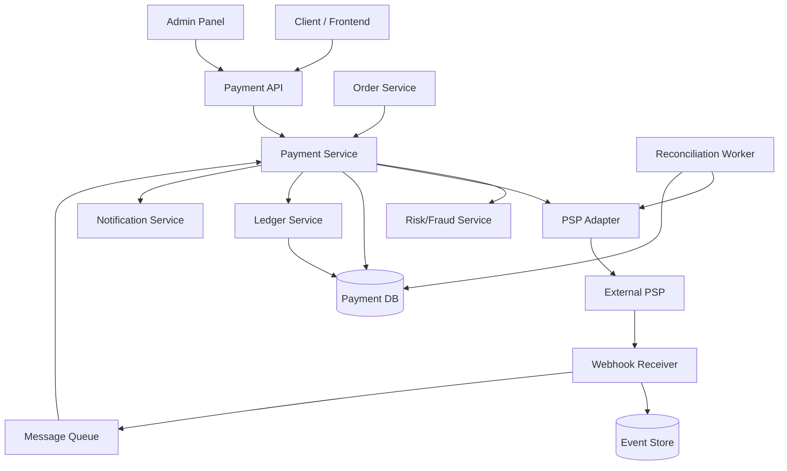
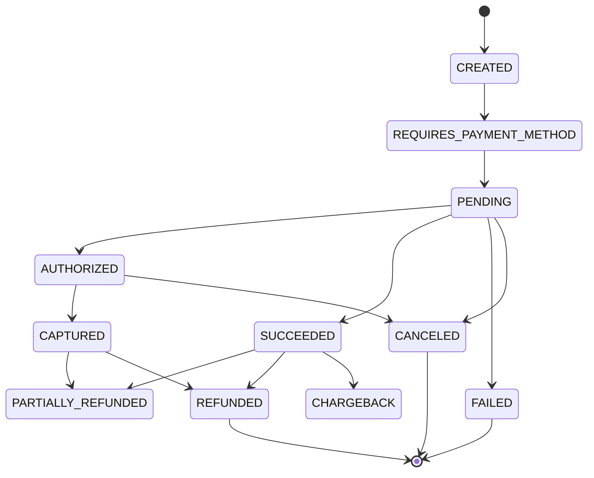
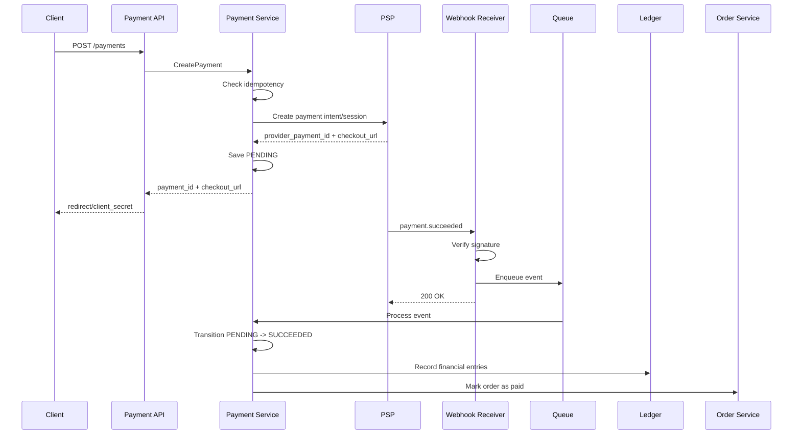
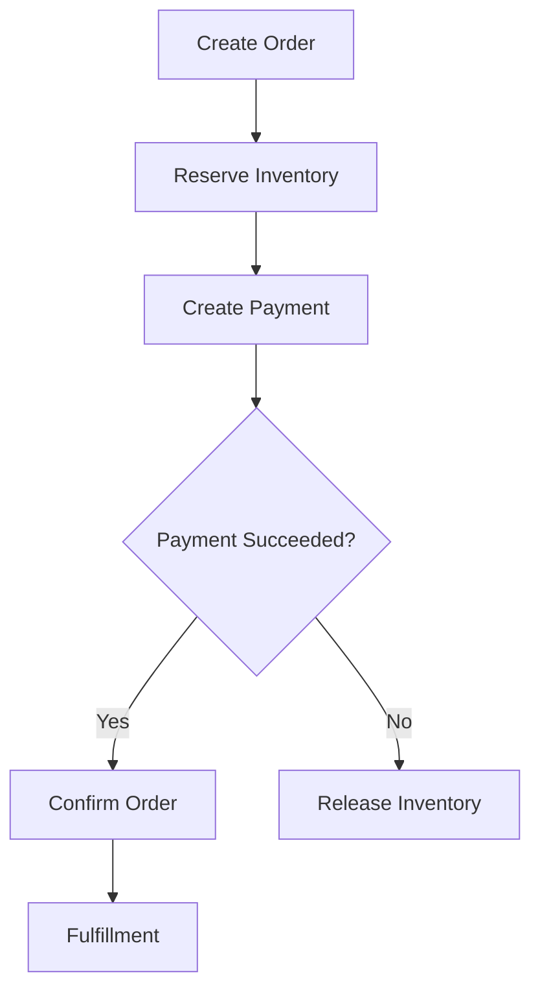
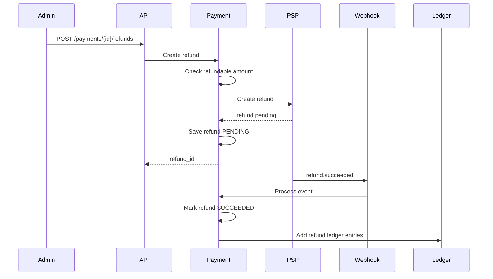
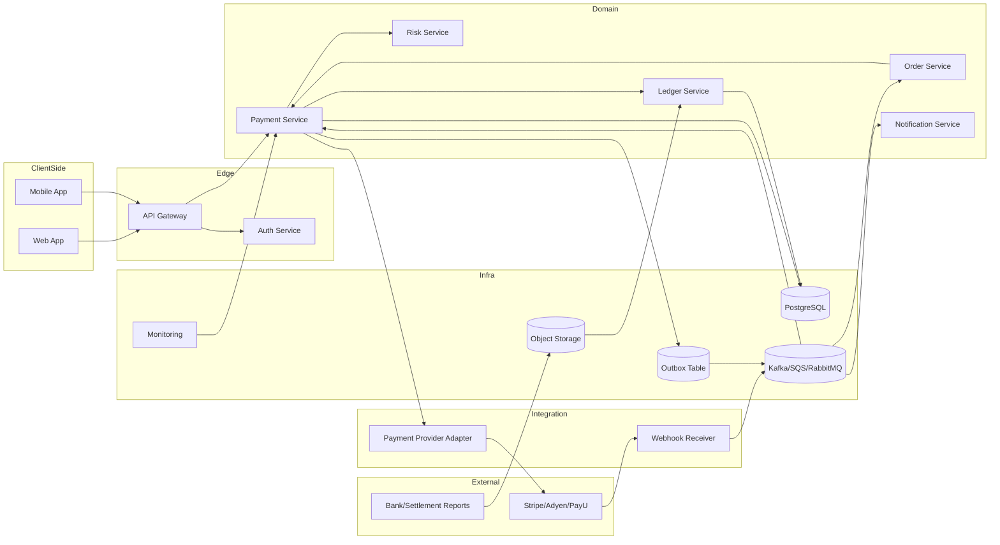

# Payment System — System Design

Kompleksowy projekt architektury systemu płatności dla aplikacji typu e-commerce, marketplace albo SaaS.

System obsługuje płatności kartą, BLIK/przelewami, Apple Pay, Google Pay oraz inne metody dostarczane przez zewnętrznych operatorów płatności, takich jak Stripe, Adyen, PayU, Przelewy24, Tpay czy PayPal.

Najważniejsza zasada projektowa:

> Payment System nie powinien być traktowany jak zwykły CRUD. To system finansowy, który musi być idempotentny, audytowalny, odporny na awarie i zgodny księgowo.

---

## Spis treści

1. [Cele systemu](#1-cele-systemu)
2. [Wymagania funkcjonalne](#2-wymagania-funkcjonalne)
3. [Wymagania niefunkcjonalne](#3-wymagania-niefunkcjonalne)
4. [Główne komponenty](#4-główne-komponenty)
5. [Podział na serwisy](#5-podział-na-serwisy)
6. [Model domenowy](#6-model-domenowy)
7. [Statusy płatności](#7-statusy-płatności)
8. [API](#8-api)
9. [Flow płatności](#9-flow-płatności)
10. [Idempotencja](#10-idempotencja)
11. [Webhook processing](#11-webhook-processing)
12. [Out-of-order events](#12-out-of-order-events)
13. [Baza danych](#13-baza-danych)
14. [Transakcje i spójność](#14-transakcje-i-spójność)
15. [Saga dla zamówienia](#15-saga-dla-zamówienia)
16. [Refund flow](#16-refund-flow)
17. [Capture flow](#17-capture-flow)
18. [Routing między PSP](#18-routing-między-psp)
19. [Fraud i Risk](#19-fraud-i-risk)
20. [Security design](#20-security-design)
21. [Reliability patterns](#21-reliability-patterns)
22. [Reconciliation](#22-reconciliation)
23. [Observability](#23-observability)
24. [Skalowanie](#24-skalowanie)
25. [Indeksy](#25-indeksy)
26. [Multi-currency](#26-multi-currency)
27. [Marketplace split payments](#27-marketplace-split-payments)
28. [Chargeback handling](#28-chargeback-handling)
29. [Payment status vs Order status](#29-payment-status-vs-order-status)
30. [Eventy domenowe](#30-eventy-domenowe)
31. [Błędy i edge cases](#31-błędy-i-edge-cases)
32. [Proponowany stack technologiczny](#32-proponowany-stack-technologiczny)
33. [Bounded contexts](#33-bounded-contexts)
34. [MVP](#34-mvp)
35. [Wersja produkcyjna](#35-wersja-produkcyjna)
36. [Decyzje architektoniczne](#36-decyzje-architektoniczne)
37. [Pytania interview](#37-pytania-interview)
38. [Ryzyka](#38-ryzyka)
39. [Docelowa architektura logiczna](#39-docelowa-architektura-logiczna)
40. [Odpowiedź na interview w 60 sekund](#40-odpowiedź-na-interview-w-60-sekund)

---

## 1. Cele systemu

System płatności ma umożliwiać:

1. Tworzenie intencji płatności.
2. Inicjowanie płatności u zewnętrznego PSP, np. Stripe, Adyen, PayU, Przelewy24.
3. Obsługę statusów płatności asynchronicznie przez webhooki.
4. Zapewnienie idempotencji — brak podwójnych obciążeń.
5. Obsługę zwrotów, anulowań i chargebacków.
6. Spójność finansową mimo awarii, timeoutów i retry.
7. Audytowalność każdej operacji.
8. Reconciliation — porównywanie księgi wewnętrznej z danymi PSP/banku.
9. Integrację z zamówieniami, fakturowaniem, subskrypcjami lub portfelem użytkownika.

Najważniejsze założenie: **Payment System nie powinien ślepo ufać synchronicznej odpowiedzi od PSP**.

Źródłem prawdy o finalnym statusie płatności powinien być kontrolowany model stanu oparty o:

- webhooki,
- polling awaryjny,
- reconciliation,
- maszynę stanów,
- ledger.

---

## 2. Wymagania funkcjonalne

### Core flow

Użytkownik wybiera metodę płatności, system tworzy `PaymentIntent`, następnie wywołuje PSP i otrzymuje URL, session albo token do płatności. Po zakończeniu transakcji PSP wysyła webhook z finalnym statusem.

System powinien obsługiwać:

- płatności jednorazowe,
- autoryzację i capture,
- płatności natychmiastowe,
- płatności asynchroniczne,
- zwroty pełne i częściowe,
- anulowanie płatności,
- retry płatności,
- webhooki,
- ledger księgowy,
- raportowanie i reconciliation,
- idempotentne API,
- audyt zdarzeń.

### Przykładowe operacje

- `CreatePayment`
- `ConfirmPayment`
- `CapturePayment`
- `CancelPayment`
- `RefundPayment`
- `GetPaymentStatus`
- `HandleWebhook`
- `ReconcilePayments`
- `ListTransactions`

---

## 3. Wymagania niefunkcjonalne

### Dostępność

Payment System powinien być wysoko dostępny, bo blokuje przychód.

Zakładany target:

- API: 99.95%+
- Webhook Receiver: 99.99%
- Reconciliation i background jobs: eventual consistency

### Spójność

Nie każda część systemu musi być silnie spójna. Natomiast operacje finansowe muszą być:

- idempotentne,
- audytowalne,
- odporne na powtórzenia,
- monotoniczne w zmianach statusu,
- zgodne z wewnętrzną księgą.

Preferowany model:

> Eventual consistency + silna kontrola przejść stanu płatności.

### Latency

Typowe cele:

- `CreatePayment`: < 300–800 ms, zależnie od PSP
- `GetPaymentStatus`: < 100 ms
- Webhook processing: szybkie potwierdzenie, cięższa logika async

Webhook endpoint powinien szybko zwracać `2xx`, po zapisaniu eventu do trwałego storage albo kolejki. Nie powinien robić całej logiki synchronicznie.

### Bezpieczeństwo

System musi brać pod uwagę:

- PCI DSS — najlepiej nie przechowywać danych kart,
- tokenizację metod płatności,
- podpisy webhooków,
- mTLS albo podpisy dla komunikacji między usługami,
- szyfrowanie danych w spoczynku i w tranzycie,
- RBAC dla paneli administracyjnych,
- audyt działań operatorów,
- ochronę przed replay attack,
- rate limiting,
- fraud detection.

---

## 4. Główne komponenty



---

## 5. Podział na serwisy

### 5.1 Payment API

Publiczne albo wewnętrzne API do zarządzania płatnościami.

Odpowiada za:

- przyjmowanie żądań płatności,
- walidację,
- autoryzację,
- idempotency key,
- routing do Payment Service,
- zwracanie statusów.

Nie powinien zawierać ciężkiej logiki finansowej.

---

### 5.2 Payment Service

Centralny serwis domenowy.

Odpowiada za:

- tworzenie płatności,
- maszynę stanów,
- obsługę capture/cancel/refund,
- walidację przejść statusów,
- zapis do bazy,
- publikację eventów,
- integrację z ledgerem,
- koordynację z Order Service.

To jest najważniejszy komponent systemu.

---

### 5.3 PSP Adapter

Warstwa antykorupcyjna między systemem a zewnętrznymi operatorami.

Powinna ukrywać różnice między PSP:

- Stripe,
- Adyen,
- PayPal,
- PayU,
- Przelewy24,
- Tpay,
- Klarna.

Adapter powinien wystawiać wspólny interfejs:

```ts
interface PaymentProvider {
  createPayment(request): ProviderPaymentResponse;
  capturePayment(providerPaymentId, amount): ProviderCaptureResponse;
  cancelPayment(providerPaymentId): ProviderCancelResponse;
  refundPayment(providerPaymentId, amount): ProviderRefundResponse;
  getPaymentStatus(providerPaymentId): ProviderStatusResponse;
  verifyWebhook(headers, body): VerifiedWebhookEvent;
}
```

Dzięki temu można dodać nowego PSP bez przebudowy domeny.

---

### 5.4 Webhook Receiver

Osobny komponent do odbierania webhooków od PSP.

Ważne zasady:

1. Zweryfikuj podpis webhooka.
2. Zapisz surowy event.
3. Nadaj mu unikalny identyfikator.
4. Odrzuć duplikaty.
5. Wrzuć event do kolejki.
6. Zwróć `2xx` jak najszybciej.

Webhooki muszą być traktowane jako **at-least-once delivery**. PSP może wysłać ten sam event wielokrotnie.

---

### 5.5 Ledger Service

Ledger jest wewnętrzną księgą zdarzeń finansowych.

Nie powinno się opierać rozliczeń wyłącznie na tabeli `payments`, bo status płatności nie jest wystarczającym modelem księgowym.

Ledger powinien przechowywać wpisy typu:

- debit,
- credit,
- authorization hold,
- capture,
- refund,
- fee,
- payout,
- adjustment,
- chargeback.

Dobrą praktyką jest model **double-entry ledger**, czyli każdy ruch finansowy ma co najmniej dwa wpisy: skąd środki wychodzą i dokąd trafiają.

Przykład płatności:

| Account | Debit | Credit |
|---|---:|---:|
| User external payment account | 100 PLN |  |
| Merchant pending balance |  | 100 PLN |

Przykład fee:

| Account | Debit | Credit |
|---|---:|---:|
| Merchant pending balance | 3 PLN |  |
| Platform fee revenue |  | 3 PLN |

---

### 5.6 Reconciliation Worker

Reconciliation sprawdza, czy stan w systemie zgadza się ze stanem PSP albo banku.

Powinien cyklicznie:

- pobierać raporty PSP,
- porównywać transakcje,
- wykrywać brakujące webhooki,
- wykrywać rozjazdy kwot,
- wykrywać błędne statusy,
- oznaczać transakcje do ręcznej weryfikacji,
- emitować korekty ledgerowe.

To jest bardzo ważny komponent. W realnych płatnościach webhooki potrafią się zgubić, przyjść z opóźnieniem albo przyjść w dziwnej kolejności.

---

## 6. Model domenowy

### Payment

Reprezentuje próbę zapłaty za konkretny obiekt biznesowy, np. order, invoice, subscription.

```json
{
  "payment_id": "pay_123",
  "merchant_id": "mer_123",
  "customer_id": "cus_123",
  "order_id": "ord_123",
  "amount": 10000,
  "currency": "PLN",
  "status": "REQUIRES_PAYMENT_METHOD",
  "provider": "stripe",
  "provider_payment_id": "pi_abc",
  "idempotency_key": "idem_123",
  "created_at": "2026-06-05T10:00:00Z",
  "updated_at": "2026-06-05T10:00:01Z"
}
```

Kwoty powinny być trzymane jako integer w najmniejszej jednostce waluty, np. grosze, eurocenty, centy. Nie używać `float`.

---

### PaymentAttempt

Jeden `Payment` może mieć wiele prób.

Przykład: użytkownik najpierw próbuje kartą, potem BLIK-iem.

```json
{
  "attempt_id": "pa_123",
  "payment_id": "pay_123",
  "method": "card",
  "provider": "stripe",
  "provider_attempt_id": "pi_abc",
  "status": "FAILED",
  "failure_code": "card_declined",
  "created_at": "..."
}
```

---

### Refund

```json
{
  "refund_id": "ref_123",
  "payment_id": "pay_123",
  "amount": 5000,
  "currency": "PLN",
  "status": "PENDING",
  "reason": "customer_request",
  "provider_refund_id": "re_abc",
  "created_at": "..."
}
```

---

### WebhookEvent

```json
{
  "event_id": "evt_123",
  "provider": "stripe",
  "provider_event_id": "evt_external_123",
  "event_type": "payment.succeeded",
  "payload": {},
  "signature_valid": true,
  "processed": false,
  "received_at": "..."
}
```

---

### LedgerEntry

```json
{
  "ledger_entry_id": "le_123",
  "transaction_id": "txn_123",
  "account_id": "merchant_pending_balance",
  "direction": "credit",
  "amount": 10000,
  "currency": "PLN",
  "reference_type": "payment",
  "reference_id": "pay_123",
  "created_at": "..."
}
```

---

## 7. Statusy płatności

Przykładowa maszyna stanów:



| Status | Znaczenie |
|---|---|
| `CREATED` | Płatność utworzona lokalnie |
| `REQUIRES_PAYMENT_METHOD` | Brakuje metody płatności |
| `PENDING` | Płatność trwa u PSP |
| `AUTHORIZED` | Środki zablokowane, ale jeszcze nie pobrane |
| `SUCCEEDED` | Płatność zakończona sukcesem |
| `CAPTURED` | Środki pobrane po wcześniejszej autoryzacji |
| `FAILED` | Płatność nieudana |
| `CANCELED` | Płatność anulowana |
| `PARTIALLY_REFUNDED` | Częściowy zwrot |
| `REFUNDED` | Pełny zwrot |
| `CHARGEBACK` | Spór/chargeback |

Ważne: przejścia statusów muszą być walidowane. Nie można pozwolić, żeby przestarzały webhook cofnął status z `SUCCEEDED` na `PENDING`.

---

## 8. API

### Create Payment

```http
POST /v1/payments
Idempotency-Key: 6b8c0f2a-...
Authorization: Bearer ...
```

```json
{
  "order_id": "ord_123",
  "customer_id": "cus_123",
  "amount": 10000,
  "currency": "PLN",
  "payment_method": "card",
  "provider": "stripe",
  "return_url": "https://shop.com/payment/return"
}
```

Response:

```json
{
  "payment_id": "pay_123",
  "status": "PENDING",
  "checkout_url": "https://provider.com/checkout/abc",
  "client_secret": "secret_abc"
}
```

---

### Get Payment Status

```http
GET /v1/payments/pay_123
```

```json
{
  "payment_id": "pay_123",
  "status": "SUCCEEDED",
  "amount": 10000,
  "currency": "PLN",
  "order_id": "ord_123"
}
```

---

### Capture Payment

```http
POST /v1/payments/pay_123/capture
Idempotency-Key: capture-123
```

```json
{
  "amount": 10000
}
```

---

### Refund Payment

```http
POST /v1/payments/pay_123/refunds
Idempotency-Key: refund-123
```

```json
{
  "amount": 5000,
  "reason": "customer_request"
}
```

---

### Webhook

```http
POST /v1/webhooks/stripe
Stripe-Signature: ...
```

Webhook endpoint nie powinien zakładać, że eventy przychodzą w kolejności.

---

## 9. Flow płatności



---

## 10. Idempotencja

Idempotencja jest absolutnie krytyczna.

Bez niej użytkownik może kliknąć „Zapłać” dwa razy, frontend może ponowić request, API Gateway może powtórzyć request po timeoutcie, a PSP może zwrócić odpowiedź z opóźnieniem.

### Gdzie potrzebna jest idempotencja?

- `POST /payments`
- `POST /capture`
- `POST /refunds`
- webhook processing
- ledger writes
- komunikacja z PSP

### Tabela idempotencji

```sql
CREATE TABLE idempotency_keys (
    idempotency_key TEXT NOT NULL,
    scope TEXT NOT NULL,
    request_hash TEXT NOT NULL,
    response_body JSONB,
    status TEXT NOT NULL,
    created_at TIMESTAMP NOT NULL,
    expires_at TIMESTAMP NOT NULL,
    PRIMARY KEY (idempotency_key, scope)
);
```

### Zasada

Jeśli ten sam `Idempotency-Key` przychodzi z tym samym payloadem, zwracamy tę samą odpowiedź.

Jeśli ten sam klucz przychodzi z innym payloadem, zwracamy błąd:

```http
409 Conflict
```

---

## 11. Webhook processing

Webhooki powinny być przetwarzane idempotentnie.

```sql
CREATE TABLE webhook_events (
    id UUID PRIMARY KEY,
    provider TEXT NOT NULL,
    provider_event_id TEXT NOT NULL,
    event_type TEXT NOT NULL,
    payload JSONB NOT NULL,
    processed_at TIMESTAMP,
    created_at TIMESTAMP NOT NULL,
    UNIQUE(provider, provider_event_id)
);
```

Flow:

1. Odbierz webhook.
2. Zweryfikuj podpis.
3. Sprawdź `provider_event_id`.
4. Jeśli event już istnieje, zwróć `200 OK`.
5. Zapisz event.
6. Wrzuć event do kolejki.
7. Worker przetwarza event.
8. Worker wykonuje kontrolowane przejście stanu.
9. Worker zapisuje ledger entries.
10. Worker oznacza event jako processed.

---

## 12. Out-of-order events

PSP może wysłać eventy w kolejności:

1. `payment.succeeded`
2. `payment.processing`

Gdybyśmy naiwnie nadpisywali status, system mógłby cofnąć płatność z `SUCCEEDED` do `PENDING`.

Dlatego statusy powinny mieć reguły monotoniczne.

Przykład:

```ts
const allowedTransitions = {
  PENDING: ["AUTHORIZED", "SUCCEEDED", "FAILED", "CANCELED"],
  AUTHORIZED: ["CAPTURED", "CANCELED"],
  SUCCEEDED: ["PARTIALLY_REFUNDED", "REFUNDED", "CHARGEBACK"],
  CAPTURED: ["PARTIALLY_REFUNDED", "REFUNDED", "CHARGEBACK"],
  FAILED: [],
  CANCELED: [],
  REFUNDED: []
};
```

Jeśli event próbuje wykonać nielegalną zmianę, zapisujemy go do audytu, ale nie zmieniamy statusu.

---

## 13. Baza danych

### Payments

```sql
CREATE TABLE payments (
    payment_id UUID PRIMARY KEY,
    merchant_id UUID NOT NULL,
    customer_id UUID,
    order_id UUID NOT NULL,
    amount BIGINT NOT NULL,
    currency CHAR(3) NOT NULL,
    status TEXT NOT NULL,
    provider TEXT NOT NULL,
    provider_payment_id TEXT,
    idempotency_key TEXT,
    created_at TIMESTAMP NOT NULL,
    updated_at TIMESTAMP NOT NULL,
    version BIGINT NOT NULL DEFAULT 0,

    UNIQUE(provider, provider_payment_id),
    UNIQUE(merchant_id, idempotency_key)
);
```

`version` służy do optimistic locking.

---

### Payment Attempts

```sql
CREATE TABLE payment_attempts (
    attempt_id UUID PRIMARY KEY,
    payment_id UUID NOT NULL REFERENCES payments(payment_id),
    provider TEXT NOT NULL,
    provider_attempt_id TEXT,
    payment_method TEXT NOT NULL,
    status TEXT NOT NULL,
    failure_code TEXT,
    failure_message TEXT,
    created_at TIMESTAMP NOT NULL,

    UNIQUE(provider, provider_attempt_id)
);
```

---

### Refunds

```sql
CREATE TABLE refunds (
    refund_id UUID PRIMARY KEY,
    payment_id UUID NOT NULL REFERENCES payments(payment_id),
    amount BIGINT NOT NULL,
    currency CHAR(3) NOT NULL,
    status TEXT NOT NULL,
    reason TEXT,
    provider_refund_id TEXT,
    idempotency_key TEXT,
    created_at TIMESTAMP NOT NULL,
    updated_at TIMESTAMP NOT NULL,

    UNIQUE(payment_id, idempotency_key),
    UNIQUE(provider_refund_id)
);
```

---

### Ledger Transactions

```sql
CREATE TABLE ledger_transactions (
    transaction_id UUID PRIMARY KEY,
    reference_type TEXT NOT NULL,
    reference_id UUID NOT NULL,
    transaction_type TEXT NOT NULL,
    created_at TIMESTAMP NOT NULL,

    UNIQUE(reference_type, reference_id, transaction_type)
);
```

---

### Ledger Entries

```sql
CREATE TABLE ledger_entries (
    entry_id UUID PRIMARY KEY,
    transaction_id UUID NOT NULL REFERENCES ledger_transactions(transaction_id),
    account_id TEXT NOT NULL,
    direction TEXT NOT NULL CHECK (direction IN ('debit', 'credit')),
    amount BIGINT NOT NULL CHECK (amount > 0),
    currency CHAR(3) NOT NULL,
    created_at TIMESTAMP NOT NULL
);
```

Wymuszamy zasadę: suma debitów musi równać się sumie creditów dla `transaction_id`.

Tego nie zawsze łatwo wymusić prostym constraintem SQL, więc można to robić w transakcji aplikacyjnej albo przez stored procedure.

---

## 14. Transakcje i spójność

Nie da się wykonać jednej transakcji obejmującej:

- własną bazę danych,
- zewnętrzne PSP,
- kolejkę,
- Order Service.

Dlatego nie używamy rozproszonego 2PC, tylko wzorce:

- idempotency,
- transactional outbox,
- saga,
- retry,
- reconciliation.

### Transactional Outbox

Gdy Payment Service zmienia status płatności, zapisuje też event do tabeli `outbox_events` w tej samej transakcji.

```sql
CREATE TABLE outbox_events (
    event_id UUID PRIMARY KEY,
    aggregate_type TEXT NOT NULL,
    aggregate_id UUID NOT NULL,
    event_type TEXT NOT NULL,
    payload JSONB NOT NULL,
    published_at TIMESTAMP,
    created_at TIMESTAMP NOT NULL
);
```

Worker publikuje eventy do Kafka, RabbitMQ albo SQS.

Dzięki temu unikamy sytuacji:

- status płatności zapisany,
- event do Order Service nieopublikowany,
- order nigdy nie zostaje oznaczony jako paid.

---

## 15. Saga dla zamówienia

Płatność zwykle jest częścią większego procesu.



Jeśli płatność nie powiedzie się, trzeba zwolnić rezerwację produktów.

Jeśli order zostanie anulowany po autoryzacji, trzeba anulować autoryzację albo zrobić refund po capture.

---

## 16. Refund flow



### Walidacja refundu

System musi pilnować:

```text
sum(successful_refunds) + new_refund_amount <= captured_amount
```

Dla równoległych refundów trzeba użyć blokady:

```sql
SELECT * FROM payments WHERE payment_id = ? FOR UPDATE;
```

albo optimistic locking.

---

## 17. Capture flow

Niektóre systemy potrzebują autoryzacji i późniejszego capture.

Przykłady:

- hotel,
- wynajem auta,
- marketplace,
- zamówienie z późniejszą wysyłką.

Flow:

1. Autoryzuj środki.
2. Zarezerwuj zamówienie.
3. Po spełnieniu warunków wykonaj capture.
4. Jeśli zamówienie anulowano — cancel authorization.

Statusy:

```text
AUTHORIZED -> CAPTURED
AUTHORIZED -> CANCELED
```

Nie powinno się robić capture dwa razy dla tej samej autoryzacji bez kontroli idempotencji.

---

## 18. Routing między PSP

W bardziej zaawansowanym systemie można mieć wiele PSP.

Routing może zależeć od:

- kraju,
- waluty,
- metody płatności,
- kosztu transakcji,
- availability PSP,
- skuteczności akceptacji,
- MCC/merchant category,
- ryzyka fraudu,
- A/B testów.

Przykład:

```ts
function selectProvider(payment) {
  if (payment.currency === "PLN" && payment.method === "blik") {
    return "payu";
  }

  if (payment.currency === "EUR" && payment.method === "card") {
    return "adyen";
  }

  return "stripe";
}
```

Ważne: routing powinien być deterministyczny dla jednej płatności. Nie można przypadkowo utworzyć tej samej płatności u dwóch PSP.

---

## 19. Fraud i Risk

Przed stworzeniem płatności albo przed capture można wykonać risk scoring.

Sygnały:

- kraj karty vs kraj użytkownika,
- liczba prób płatności,
- nietypowa kwota,
- velocity checks,
- fingerprint urządzenia,
- historia chargebacków,
- proxy/VPN,
- nietypowy BIN karty,
- wiele kont na jedną kartę.

Decyzje:

- allow,
- block,
- manual review,
- require 3DS,
- limit amount.

Fraud Service nie powinien bezpośrednio zmieniać ledgeru. Powinien zwracać decyzję do Payment Service.

---

## 20. Security design

### Dane kart

Najlepiej nie przechowywać danych kart w ogóle.

Zamiast tego:

- frontend korzysta z komponentów PSP,
- PSP tokenizuje kartę,
- backend dostaje tylko token/metodę płatności,
- system przechowuje `payment_method_token`.

Dzięki temu ograniczamy zakres PCI.

### Webhook security

Webhook musi być zabezpieczony przez:

- podpis HMAC albo mechanizm PSP,
- timestamp w podpisie,
- ochronę przed replay,
- allowlistę IP — pomocniczo, nie jako jedyne zabezpieczenie,
- zapis surowego payloadu,
- brak zaufania do danych bez weryfikacji.

### Admin security

Panel admina musi mieć:

- RBAC,
- MFA,
- audit log,
- ograniczenia dla refundów wysokiej wartości,
- zasadę czterech oczu dla ręcznych korekt,
- limity dzienne operatora.

---

## 21. Reliability patterns

### Retry

Retry powinien być stosowany ostrożnie.

Dla wywołań do PSP:

- retry tylko na błędach timeout/5xx,
- exponential backoff,
- jitter,
- idempotency key przekazywany do PSP,
- circuit breaker.

Nie retry’ować automatycznie błędów typu:

- card declined,
- insufficient funds,
- invalid payment method.

### Circuit breaker

Jeżeli PSP ma awarię, system powinien:

- przestać wysyłać nowe requesty do tego PSP,
- przełączyć routing na innego PSP, jeśli możliwe,
- oznaczyć płatności jako `PENDING_PROVIDER_CONFIRMATION`,
- uruchomić reconciliation po powrocie PSP.

### Dead Letter Queue

Eventy, których nie da się przetworzyć, trafiają do DLQ.

Powody:

- brak paymentu lokalnie,
- błędny payload,
- konflikt stanu,
- błąd walidacji,
- powtarzający się błąd zależności.

DLQ musi być monitorowana.

---

## 22. Reconciliation

To jest często pomijany element, a w realnym systemie jest krytyczny.

### Payment reconciliation

Porównuje lokalne płatności z PSP.

Wykrywa:

- lokalnie `PENDING`, u PSP `SUCCEEDED`,
- lokalnie `SUCCEEDED`, u PSP brak transakcji,
- różne kwoty,
- różne waluty,
- brakujące refundy.

### Settlement reconciliation

Porównuje środki wypłacone przez PSP z oczekiwanymi środkami w ledgerze.

Uwzględnia:

- fees,
- chargebacki,
- refundy,
- rolling reserve,
- FX conversion,
- payout delay.

### Ledger reconciliation

Sprawdza, czy ledger jest zbilansowany.

Każda transakcja musi mieć:

```text
sum(debits) = sum(credits)
```

---

## 23. Observability

### Metryki

Warto monitorować:

- liczba paymentów per status,
- payment success rate,
- authorization rate,
- refund rate,
- chargeback rate,
- PSP latency,
- PSP error rate,
- webhook processing delay,
- webhook duplicate rate,
- reconciliation mismatches,
- DLQ size,
- liczba płatności w `PENDING` dłużej niż X minut.

### Logi

Każde zdarzenie powinno mieć:

- `payment_id`,
- `order_id`,
- `customer_id`,
- `provider`,
- `provider_payment_id`,
- `idempotency_key`,
- `correlation_id`,
- `request_id`.

Nie logować danych kart ani wrażliwych danych płatniczych.

### Alerty

Alerty dla:

- spadku success rate,
- wzrostu failed payments,
- wzrostu latency PSP,
- webhook receiver errors,
- dużej liczby stuck payments,
- DLQ > 0 dla krytycznych eventów,
- reconciliation mismatch powyżej progu.

---

## 24. Skalowanie

### Payment API

Stateless, skalowane horyzontalnie za API Gateway albo Load Balancerem.

### Payment DB

Najpierw jedna relacyjna baza, np. PostgreSQL.

Dla większej skali:

- read replicas,
- partycjonowanie po dacie,
- indeksy po `payment_id`, `order_id`, `provider_payment_id`,
- archiwizacja starych płatności,
- osobny magazyn analityczny.

### Webhook Receiver

Skalowany osobno, bo ruch webhookowy może mieć inne piki niż ruch użytkowników.

### Queue Workers

Skalowanie przez liczbę konsumentów.

Uwaga: dla jednego `payment_id` dobrze zachować ordering. Można partycjonować kolejkę po `payment_id`.

---

## 25. Indeksy

Przykładowe indeksy:

```sql
CREATE INDEX idx_payments_order_id ON payments(order_id);
CREATE INDEX idx_payments_customer_id ON payments(customer_id);
CREATE INDEX idx_payments_status_created_at ON payments(status, created_at);
CREATE INDEX idx_payments_provider_payment_id ON payments(provider, provider_payment_id);

CREATE INDEX idx_refunds_payment_id ON refunds(payment_id);
CREATE INDEX idx_webhook_events_provider_event_id ON webhook_events(provider, provider_event_id);
CREATE INDEX idx_ledger_entries_reference ON ledger_entries(reference_type, reference_id);
```

---

## 26. Multi-currency

Kwoty trzymamy jako integer + currency.

Nie wolno mieszać walut w jednej operacji ledgerowej bez jawnej konwersji.

Dla FX potrzebne są:

- źródło kursu,
- timestamp kursu,
- spread,
- kwota źródłowa,
- kwota docelowa,
- waluta źródłowa,
- waluta docelowa.

Przykład:

```json
{
  "source_amount": 10000,
  "source_currency": "EUR",
  "target_amount": 43210,
  "target_currency": "PLN",
  "fx_rate": "4.3210",
  "rate_provider": "ECB",
  "rate_timestamp": "2026-06-05T10:00:00Z"
}
```

Dla pieniędzy używać decimal/string albo integer fixed-point. Nie używać float.

---

## 27. Marketplace split payments

Jeśli system obsługuje marketplace, dochodzą:

- merchant accounts,
- platform fee,
- split settlement,
- delayed payout,
- KYC/KYB,
- rolling reserve,
- negative balance,
- dispute handling.

Przykład ledgeru dla marketplace:

Klient płaci 100 PLN.

| Account | Debit | Credit |
|---|---:|---:|
| External PSP clearing | 100 PLN |  |
| Merchant pending balance |  | 90 PLN |
| Platform revenue |  | 10 PLN |

Po payout:

| Account | Debit | Credit |
|---|---:|---:|
| Merchant available balance | 90 PLN |  |
| Merchant bank account |  | 90 PLN |

---

## 28. Chargeback handling

Chargeback nie jest zwykłym refundem.

Model powinien mieć osobny obiekt:

```json
{
  "dispute_id": "disp_123",
  "payment_id": "pay_123",
  "amount": 10000,
  "currency": "PLN",
  "status": "OPEN",
  "reason": "fraudulent",
  "evidence_due_by": "2026-06-20"
}
```

Statusy:

- `OPEN`,
- `UNDER_REVIEW`,
- `WON`,
- `LOST`,
- `CLOSED`.

Ledger musi obsłużyć:

- cofnięcie środków,
- fee chargebackowe,
- ewentualne przywrócenie środków po wygranym sporze.

---

## 29. Payment status vs Order status

To powinny być osobne modele.

Payment:

```text
PENDING -> SUCCEEDED -> REFUNDED
```

Order:

```text
CREATED -> PAID -> FULFILLED -> CANCELED
```

Nie należy utożsamiać `payment.status = SUCCEEDED` z całym stanem zamówienia. Payment Service publikuje event `PaymentSucceeded`, a Order Service sam decyduje, czy zamówienie może przejść do `PAID`.

---

## 30. Eventy domenowe

Przykładowe eventy:

```text
PaymentCreated
PaymentPending
PaymentAuthorized
PaymentSucceeded
PaymentFailed
PaymentCanceled
PaymentCaptured
PaymentRefundRequested
PaymentRefundSucceeded
PaymentRefundFailed
PaymentChargebackOpened
PaymentChargebackWon
PaymentChargebackLost
```

Przykład eventu:

```json
{
  "event_id": "evt_internal_123",
  "event_type": "PaymentSucceeded",
  "payment_id": "pay_123",
  "order_id": "ord_123",
  "amount": 10000,
  "currency": "PLN",
  "occurred_at": "2026-06-05T10:00:00Z"
}
```

---

## 31. Błędy i edge cases

### Użytkownik zapłacił, ale frontend dostał timeout

Nie oznaczamy płatności jako failed tylko dlatego, że frontend nie dostał odpowiedzi.

Rozwiązanie:

- payment pozostaje `PENDING`,
- frontend odpytuje `GET /payments/{id}`,
- webhook aktualizuje status,
- reconciliation naprawia brak webhooka.

### PSP zwrócił timeout przy create payment

Możliwe scenariusze:

1. PSP nie utworzył płatności.
2. PSP utworzył płatność, ale odpowiedź nie wróciła.

Rozwiązanie:

- używać idempotency key przy PSP,
- zrobić retry z tym samym kluczem,
- jeśli nadal niepewne, oznaczyć lokalnie `PENDING_PROVIDER_CONFIRMATION`,
- worker odpytuje PSP.

### Webhook przyszedł przed zapisem paymentu

Może się zdarzyć przy nietypowych flowach.

Rozwiązanie:

- zapisać webhook jako unprocessed,
- retry processing,
- matchować po `provider_payment_id`,
- po kilku próbach przenieść do DLQ/manual review.

### Refund i chargeback jednocześnie

Trzeba mieć blokady i reguły księgowe.

System powinien zapobiec sytuacji, w której merchant dostaje jednocześnie refund i chargeback bez korekty.

### Podwójny webhook `payment.succeeded`

Drugi webhook nie może utworzyć drugiego ledger entry.

Rozwiązanie:

- unique constraint na `provider_event_id`,
- unique constraint na ledger transaction reference,
- idempotentny processor.

---

## 32. Proponowany stack technologiczny

### Wariant rozsądny dla większości projektów

- Backend: Java/Kotlin Spring Boot, Go, Node.js/NestJS albo Python/FastAPI
- DB: PostgreSQL
- Queue: Kafka, RabbitMQ, SQS
- Cache/idempotency acceleration: Redis, ale nie jako jedyne źródło prawdy
- Observability: Prometheus, Grafana, OpenTelemetry, ELK/Loki
- Secrets: Vault / AWS Secrets Manager / GCP Secret Manager
- Deployment: Kubernetes albo managed containers
- Object storage: S3/GCS na raporty reconciliation
- Data warehouse: BigQuery/Snowflake/Redshift

### Najbezpieczniejszy wybór bazowy

Dla płatności zacząłbym od:

- PostgreSQL jako primary source of truth,
- Kafka/SQS dla eventów,
- transactional outbox,
- jeden lub dwa PSP adaptery,
- osobny webhook receiver,
- osobny reconciliation worker.

Nie zaczynałbym od mikroserwisów wszędzie. Najpierw modularny monolit albo kilka dobrze wydzielonych serwisów.

---

## 33. Bounded contexts

Sensowny podział domenowy:

```text
Order Context
- order lifecycle
- inventory reservation
- fulfillment

Payment Context
- payment intent
- payment status
- PSP integration
- refunds
- captures

Ledger Context
- financial accounting
- balances
- double-entry entries

Billing Context
- invoices
- subscriptions
- tax

Risk Context
- fraud scoring
- risk decisions

Notification Context
- emails
- SMS
- push
```

Payment Context nie powinien generować faktur VAT ani zarządzać inventory. Powinien emitować eventy.

---

## 34. MVP

Dla MVP wystarczy:

1. `Payment Service`
2. jeden PSP
3. tabela `payments`
4. webhook receiver
5. idempotency key
6. refundy
7. podstawowy ledger
8. prosty reconciliation job raz dziennie
9. metryki i alerty

Nie wrzucałbym od razu:

- wielu PSP,
- dynamicznego routingu,
- pełnego marketplace ledger,
- skomplikowanego fraud engine,
- własnego przechowywania kart.

---

## 35. Wersja produkcyjna

Dla produkcji dodałbym:

- wiele PSP,
- circuit breaker,
- DLQ,
- reconciliation settlementów,
- double-entry ledger,
- role adminów,
- manual review,
- dispute handling,
- chargeback processing,
- audit log,
- transactional outbox/inbox pattern,
- szczegółowe dashboardy,
- replay webhooków,
- backoffice do naprawy płatności.

---

## 36. Decyzje architektoniczne

### Decyzja 1: Nie przechowywać danych kart

System powinien używać tokenizacji PSP. To znacząco ogranicza ryzyko i zakres PCI.

### Decyzja 2: Webhook jako główne źródło finalizacji

Synchroniczna odpowiedź z PSP jest pomocna, ale nie powinna być jedynym źródłem prawdy.

### Decyzja 3: Idempotencja wszędzie

Każda operacja finansowa musi być odporna na powtórzenia.

### Decyzja 4: Ledger osobno od statusu paymentu

Status mówi, co się stało z płatnością. Ledger mówi, jak zmieniły się pieniądze.

### Decyzja 5: Eventual consistency zamiast 2PC

Zewnętrzne PSP i własna baza nie będą w jednej transakcji. Trzeba projektować pod retry, outbox i reconciliation.

---

## 37. Pytania interview

### Co jeśli webhook się zgubi?

System zostawia płatność jako `PENDING`, a reconciliation/polling sprawdza status u PSP i aktualizuje lokalny stan.

### Co jeśli użytkownik kliknie „zapłać” dwa razy?

`Idempotency-Key` i unikalne constrainty zapobiegają utworzeniu dwóch płatności dla tego samego żądania.

### Co jeśli PSP obciąży kartę, ale nasz system ma timeout?

Nie oznaczamy płatności jako failed. Trzymamy status niepewny i sprawdzamy PSP przez retry/reconciliation.

### Jak uniknąć podwójnego refundu?

Refund ma własny idempotency key, a suma refundów jest sprawdzana w transakcji z blokadą paymentu.

### Jak zapewnić spójność Order Service z Payment Service?

Payment Service publikuje event przez transactional outbox. Order Service konsumuje event idempotentnie.

### Jak dodać drugiego PSP?

Przez `PSP Adapter` i wspólny interfejs providerów. Routing wybiera provider przy tworzeniu płatności i zapisuje wybór w payment record.

---

## 38. Ryzyka

| Ryzyko | Mitigacja |
|---|---|
| Podwójne obciążenie klienta | Idempotency, PSP idempotency key, unique constraints |
| Zagubiony webhook | Reconciliation, polling fallback |
| Out-of-order webhook | Maszyna stanów i monotoniczne przejścia |
| Błędny refund | Blokady, ledger, limity, audyt |
| Awaria PSP | Circuit breaker, fallback provider |
| Rozjazd księgowy | Double-entry ledger, reconciliation |
| Fraud | Risk scoring, 3DS, velocity checks |
| Dane kart w systemie | Tokenizacja, hosted fields PSP |
| Nieopublikowany event | Transactional outbox |
| Błędne ręczne operacje admina | RBAC, MFA, audit log, approval flow |

---

## 39. Docelowa architektura logiczna



---

## 40. Odpowiedź na interview w 60 sekund

> Zaprojektowałbym Payment System jako osobny bounded context z Payment Service, Webhook Receiverem, PSP Adapterem, Ledgerem i Reconciliation Workerem. Payment Service tworzy płatności idempotentnie i utrzymuje kontrolowaną maszynę stanów. Integracja z PSP jest ukryta za adapterem. Finalne statusy przychodzą przez webhooki, które są zapisywane i przetwarzane asynchronicznie, z obsługą duplikatów i zdarzeń poza kolejnością. Wszystkie operacje finansowe mają idempotency key i zapis do double-entry ledger. Integracja z Order Service działa przez eventy publikowane przez transactional outbox. Dla odporności stosuję retry z backoffem, circuit breaker, DLQ i reconciliation, bo zewnętrzne PSP i webhooki nie są w 100% niezawodne. Dane kart pozostają po stronie PSP, a system przechowuje tylko tokeny i identyfikatory transakcji.

---

## Najważniejsza puenta

Największy błąd w takim projekcie to potraktowanie płatności jak zwykłego CRUD-a.

Payment System powinien być projektowany bardziej jak system księgowy z asynchroniczną integracją z zewnętrznym światem, a nie jak prosta tabela `payments` z polem `status`.
